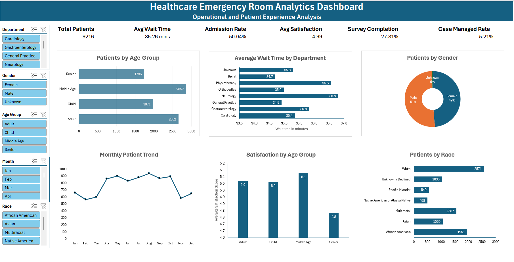

# Healthcare Emergency Room Analytics Dashboard

## Project Overview

This project analyzes emergency room operational and patient experience data using Microsoft Excel.

The dashboard was designed to provide insights into:
- patient demographics
- emergency room utilization
- patient wait times
- hospital admission trends
- departmental performance
- patient satisfaction metrics

This project demonstrates a complete Excel analytics workflow including:
- data cleaning
- data transformation
- KPI reporting
- dashboard design
- business insight generation

---

## Dashboard Preview



---

## Tools & Skills Used

### Tools
- Microsoft Excel
- Power Query
- PivotTables
- PivotCharts
- Slicers

### Skills Demonstrated
- Data Cleaning
- Data Transformation
- Data Standardization
- KPI Calculation
- Dashboard Design
- Healthcare Analytics
- Data Visualization
- Business Insight Generation

---

## Data Cleaning & Preparation

The original dataset contained:
- inconsistent date formats
- inconsistent categorical values
- null survey responses
- mixed formatting

The following cleaning steps were performed using Excel and Power Query:

- standardized admission date formats
- standardized gender categories
- standardized race categories
- handled null satisfaction survey values
- created survey completion indicators
- created admission flag numeric fields
- replaced missing department values
- engineered age group and wait time categories
- created month and weekday analytical fields

---

## Key KPIs

The dashboard includes:
- Total Patients
- Average Wait Time
- Admission Rate
- Average Satisfaction Score
- Survey Completion Rate
- Case Managed Rate

---

## Dashboard Features

### Interactive Slicers
Users can filter dashboard visualizations by:
- Gender
- Race
- Department
- Age Group
- Admission Month

### Visualizations
The dashboard contains:
- Patients by Gender
- Patients by Age Group
- Patients by Race
- Average Wait Time by Department
- Monthly Patient Trends
- Satisfaction Analysis

---

## Key Insights

- Adults represented the highest emergency room utilization group
- Some departments showed significantly higher average wait times
- Longer wait times were associated with lower patient satisfaction scores
- More than 40% of ER visits resulted in hospital admission
- Survey participation rates impacted satisfaction analysis coverage

---

## Dataset Source

Dataset: Hospital Emergency Room Dataset  
Source: Kaggle  
Author: Laxdip Patel

Dataset Link:  
https://www.kaggle.com/datasets/laxdippatel/hospital-emergency-room-dataset

The dataset was used strictly for educational and portfolio purposes.

---

## Repository Contents

```text
Hospital_ER_Data.xlsx
dashboard_screenshot.png
README.md
```

---

## How to Use

1. Download the Excel workbook
2. Open `Hospital_ER_Data.xlsx`
3. Navigate to the `Healthcare ER Dashboard` sheet
4. Use slicers to interact with the dashboard

---

## Future Improvements

Potential future enhancements include:
- SQL-based healthcare analysis
- Power BI dashboard version
- Predictive analytics integration
- Automated refresh workflows
- Advanced healthcare KPI tracking

---

## Author

Therdemis Therasme  
Data Analyst

GitHub: https://github.com/ttherasme
LinkedIn: https://linkedin.com/in/ttherasme
